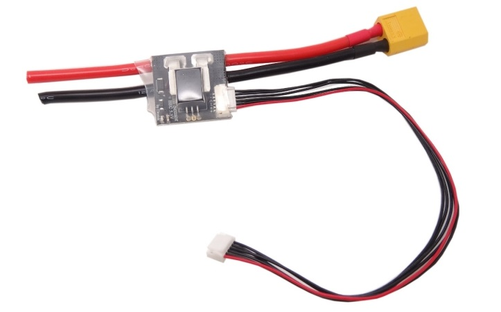
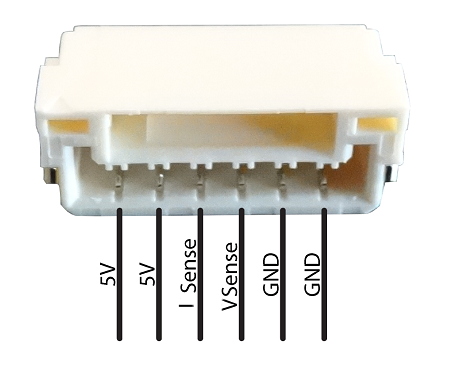
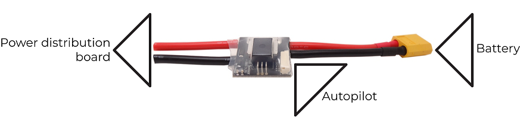
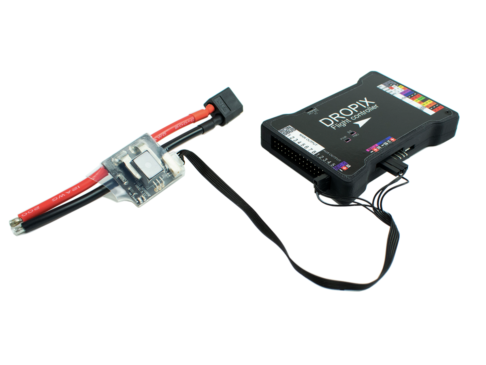

# Alimentation

## Power supply module

[_Product store page link._](https://drotek.com/shop/en/home/809-voltage-current-53v-power-supply-mounted.html)

You'll need to use a power supply module to provide **clean and regulated power** to your autopilot and other parts, as well as being able to **sense your current and voltage** real-time and overall consumption for the Dropix autopilot.

_You can find the unmounted version of this power module_ [_here_](https://drotek.com/shop/en/home/806-voltage-current-power-supply.html) _to be able to mount it yourself. You'll need to buy an XT60 \(or T-Plug\) connector and cable._

## How to plug

For a mounted power module, you will need to connect your battery to the XT60 connector, and solder the cables going out on the other side of the board to your power distribution board.

The pinout for the JST-GH connector is meant for the Pixhawk 3 PRO autopilot, which means it will be necessary to look at the exact pinout \(which can be found below\) to connect your power module correctly to your Dropix autopilot.

The power module has **two 5V outputs**, **two GND pins**, and **one pin for the current sensing**, **one pin for the voltage sensing**. As the Dropix is able to have power supply redundancy, you can use both of the 5V and GND pins to supply power on both BECs, as you can see on picture below.

On the picture below:

* BEC V is meant for voltage sensing, with the _S_ marked pin as the input for the voltage sensing signal
* BEC C is meant for current sensing, with the _S_ marked pin as the input for the current sensing signal
* Both BECs have 5V and GND pins connected to provide the redundant power supply

