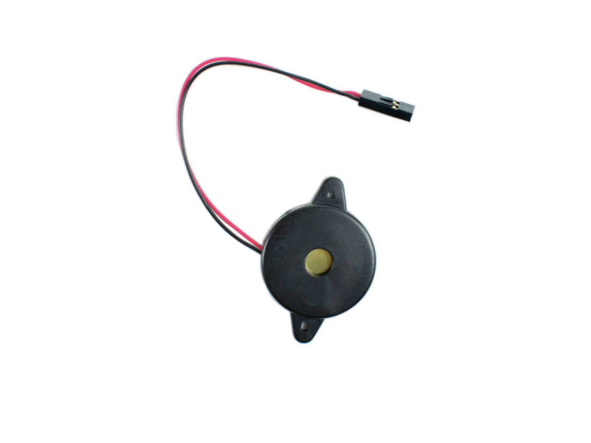
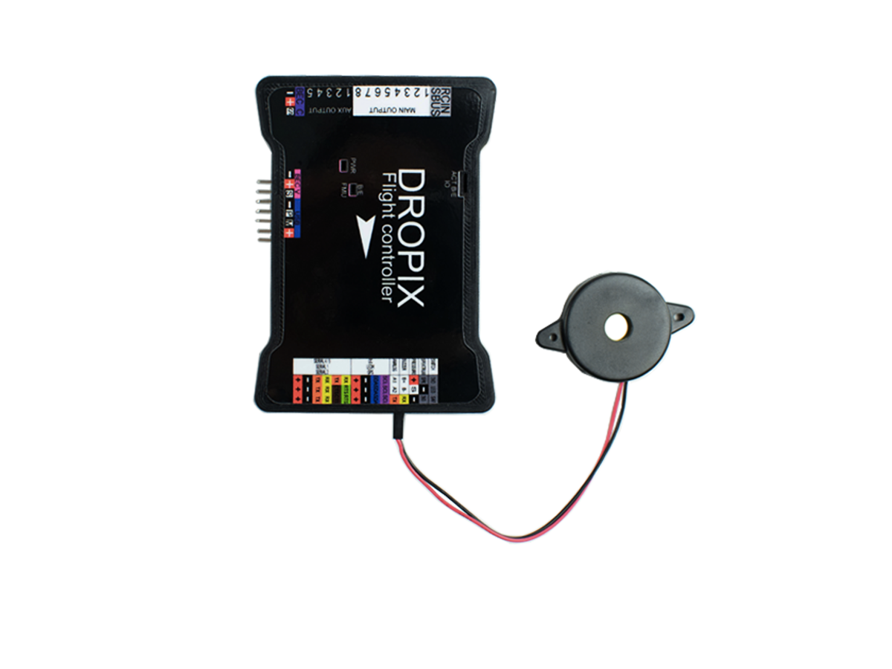
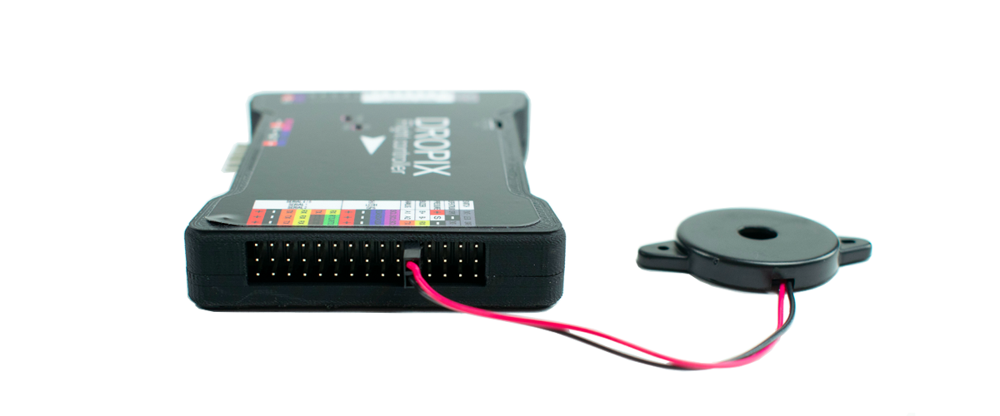

# Buzzer

The polyphonic buzzer is made to inform the user about the current state of the autopilot, letting you know when the drone is ready to be armed, ready to fly, and other different states. It will sound differently depending on the present state of the system.

You can find by [following this link](http://ardupilot.org/copter/docs/common-sounds-pixhawkpx4.html) all the sound meant to be produced by the system through the buzzer.

[Get more information about this product and shop here.](https://store.drotek.com/buzzer-piezo)

## How to plug it

The buzzer needs to be connected to the Dropix on the right of the accesories rail, on the corresponding pin headers \(marked B+ and B-\).

