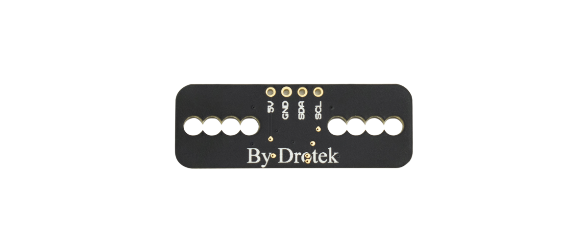
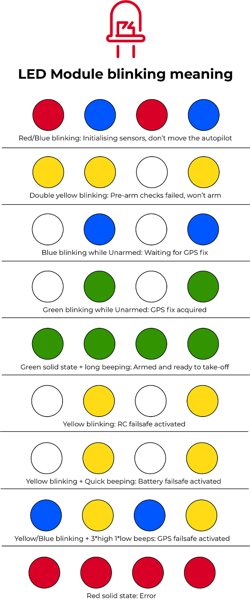
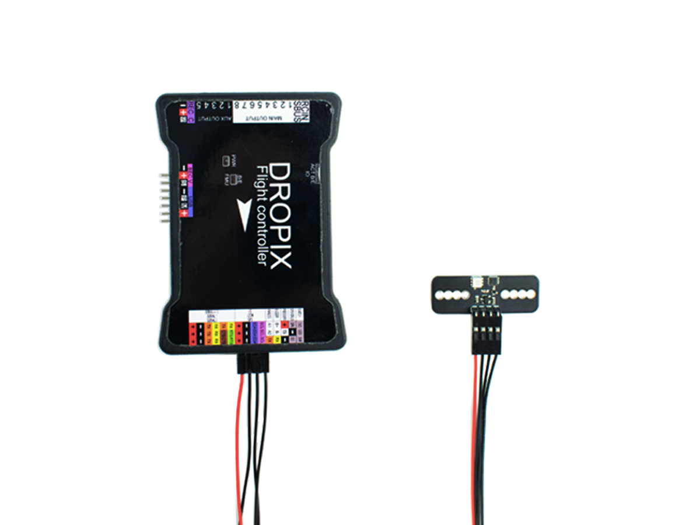
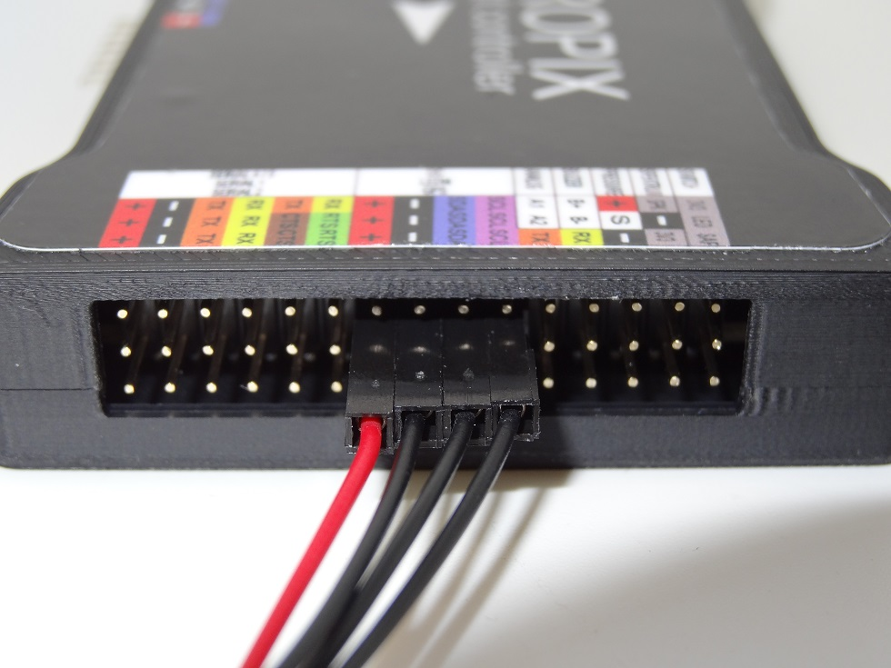

# LED Module

The LED module is built to give details about the system's state in real-time. It's different blinking patterns and colors will tell you what the system is busy with at the moment, indicating errors or checks being performed for instance.

 __[_Get more information about this product and shop here._](https://store.drotek.com/pixhawkdropix-rgb-led)\_\_

## How to plug it

The LED module has to be plugged on the accesories rail of the Dropix, where you can find a port built for the LED module.

