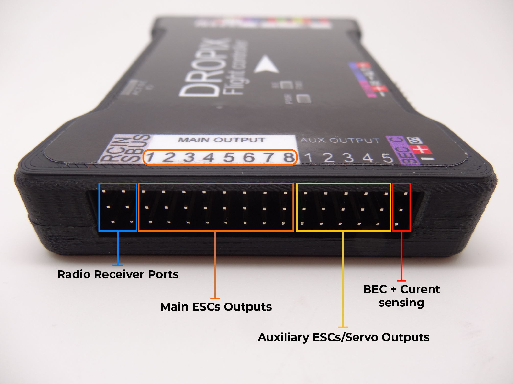
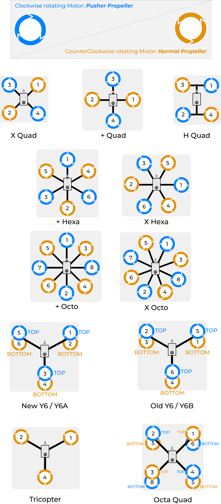

# ESC/Motors

The ESC/Motor couples are crucial for the good quality of your setup. Depending on your machine's setup, you will need different configurations for your connections and wiring.

Your ESCs will need to be plugged onto the _Main Output_ rail of the Dropix autopilot.

Depending on your configuration, you will need to take care of which ESC you plug into each Main ESC output. You should follow the picture below to know what ESC corresponds to what output depending on your vehicle:

