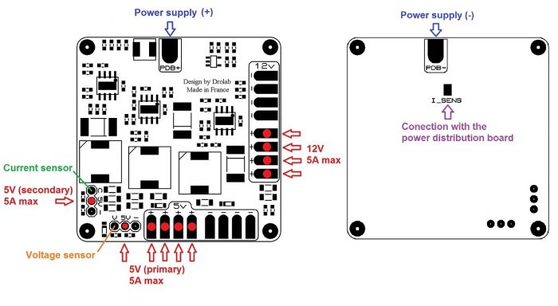

# Power Module Pro

This power supply module provides power to your Dropix flight controller and your FPV equipment with a clean and stable power from your battery.

With 2 \* 5V outputs, it offers redundant power for your flight controller. This module is capable of measuring the battery voltage and the overall consumption of your system.

It is equipped with protection against surges on each regulated output as well as a protection against inrush currents during battery connection \(anti spark\).

Each controller is equipped with a LED indicator to ensure proper operation of the power board.

