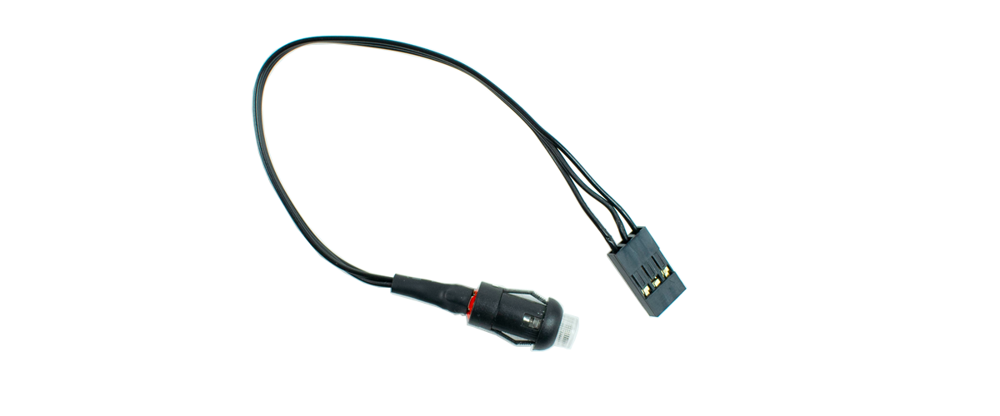
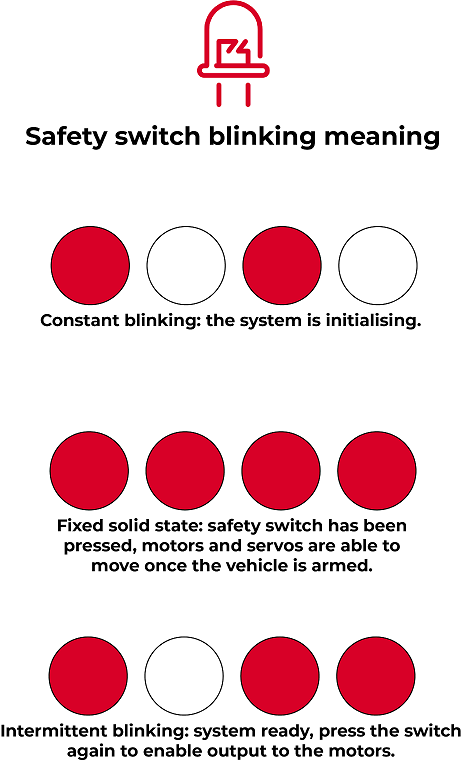
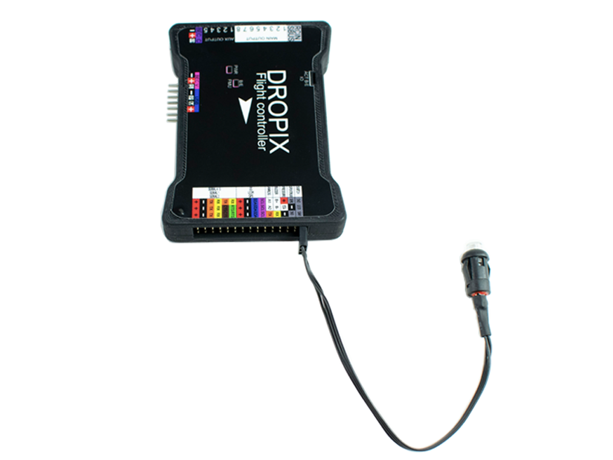
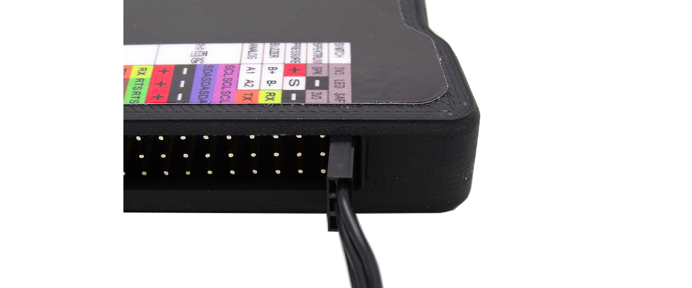

# Arming switch

[Get more information about this product and shop here.](https://store.drotek.com/led-pushbutton-switch)

In order to arm your drone, you will need to plug a switch to the board. This switch will be used to arm the drone after it has been powered up and that the hardware and software checks have been performed.

## How to plug it

Connect the switch's 3 pins JST connector to the corresponding pin headers \(marked _SWITCH_\) on the right of the accessories rail of the Dropix, with the white marked cable on the top connector.

