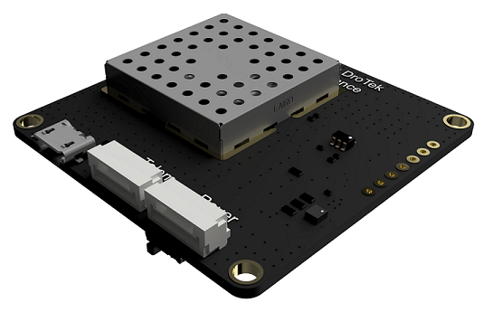

# GNSS

It is easily possible to add a GNSS module in order to be able to geolocate your drone at any time. This will get you ready to plan missions and have the drone automatically follow the route you will have prepared. Drotek sells different GNSS modules, ready to run with the Dropix autopilot. Most modules run with **NEO-M8N** and **NEO-M8T** uBlox chips, but a second range of modules came out recently, providing the RTK's **centimetric real-time positioning** using the **M8P-2** uBlox chip.

RTK technology provides an impressive accuracy when used in the best conditions, allowing for even more precise missions.

