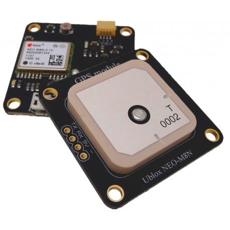
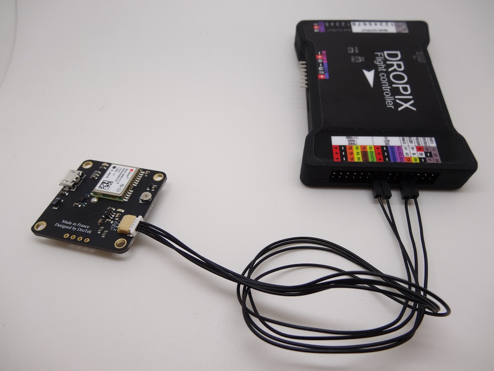

# Basic NEO-M8N module

The Basic NEO-M8N GNSS module from Drotek is the simplest GNSS board, with only the GNSS chip incorporated and not the magnetometer. It's NEO-M8N chip will provide a good positioning and offer a reliable GNSS module for your Dropix autopilot.

It's ground plane is limited but it's small form-factor will help you place it easily onto your setup.

You can find more information on [this page](https://drotek.com/shop/en/home/511-ublox-neo-m8-gps-module.html).

## Hardware

To connect your Basic NEO-M8N module, use the 4 pin JST cable to connect your module to your autopilot using the JWT headers. You should use the GPS port on the accesories rail of the Dropix, but keep in mind that this module does not come with a magnetometer, which means the I2C bus pins of the Dropix \(_SDA_ & _SCL_\) will be unused.

## Software

As this GNSS module doesn't have a magnetometer, you won't need to setup the board. After having it plugged onto your autopilot, you can power your system. This will power your GNSS board, which will automatically start to send it's positioning data to the autopilot.

For full informations concerning the setup of your GNSS board within your machine, refer to your GCS's user manual \([QgroundControl](https://docs.qgroundcontrol.com/en/) / [Mission Planner](http://ardupilot.org/planner/docs/mission-planner-overview.html)\) to see the possibilities and get informations on the quality of the GNSS communications.

