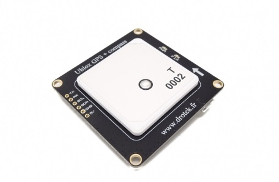
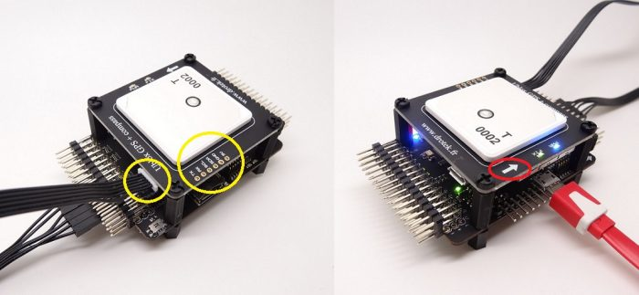

# XL module

The XL GNSS module features a u-blox **Neo M8N** chip and a **HMC5983** magnetometer to give your system the ability to know its position and orientation.

These modules offer better satellite reception than the GNSS "Mushroom" module thanks to their large antenna and their larger ground plane.

You can find more information on [this page](https://drotek.com/shop/en/drotek-parts/613-ublox-neo-m8n-gps-hmc5983-compass-xl.html?search_query=ublox&results=18).

## Hardware

To connect your XL GNSS module to your Dropix autopilot, you'll need to use a 6 pin JST-GH to 6 \* single header cable. Plug it into your XL GNSS module and then connect it to your Dropix's GPS port on the accesories rail, taking care of the pinout. Take care of installing your GNSS module heading the same way as the autopilot to reduce constraints and setup steps.

## Software

After connecting your GNSS module to your Dropix autopilot, you'll need to set it up using your favorite GCS, QGroundControl or Mission Planner.

Connect your autopilot to your GCS, and then go to the sensors settings. There, you should calibrate your compass \(both external and autopilot\) and setup the external compass's rotation in case you did not set the GNSS board heading the same way as your autopilot. Do not forget to set your autopilot so that the exernal compass is used and active.

For full informations concerning the setup of your GNSS board within your machine, refer to your GCS's user manual \([QgroundControl](https://docs.qgroundcontrol.com/en/) / [Mission Planner](http://ardupilot.org/planner/docs/mission-planner-overview.html)\)

