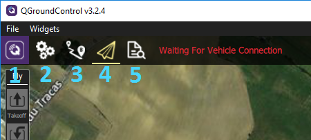

# Introduction to UI

_Note: The appearance of the software may vary depending on the platform you're running the software on._

The QGroundControl software has many features. Key ones are:

* Full setup/configuration of ArduPilot and PX4 Pro powered vehicles.
* Flight support for vehicles running PX4 and ArduPilot \(or any other autopilot that communicates using the MAVLink protocol\).
* Mission planning for autonomous flight.
* Flight map display showing vehicle position, flight track, waypoints and vehicle instruments.
* Video streaming with instrument display overlays.
* Support for managing multiple vehicles.

After opening the software, you should land on the main window of the program.

The top hotbar will provide access to different menus:

* 1 : **General QGroundControl Options** for setting up the software, accessing its console, configuring RTK features, and more. 
* 2 : **Setup View** for ugrading your autopilot's firmware, and overviewing your vehicle's sensors setup and status.
* 3 : **Plan View** to setup an automatic mission that will be executed by the vehicle.
* 4 : **Fly View** to see real-time informations on your vehicle's position, altitude, and various other data.
* 5 : **Analyze View** to check the flight logs, geotag images, and run the MAVLink console.

You will find a complete official user guide for the software by [following this link](https://docs.qgroundcontrol.com/en/) where you will be able to find informations on how to calibrate sensors, plan a mission, upgrade your autopilot's firmware, and many more options!

